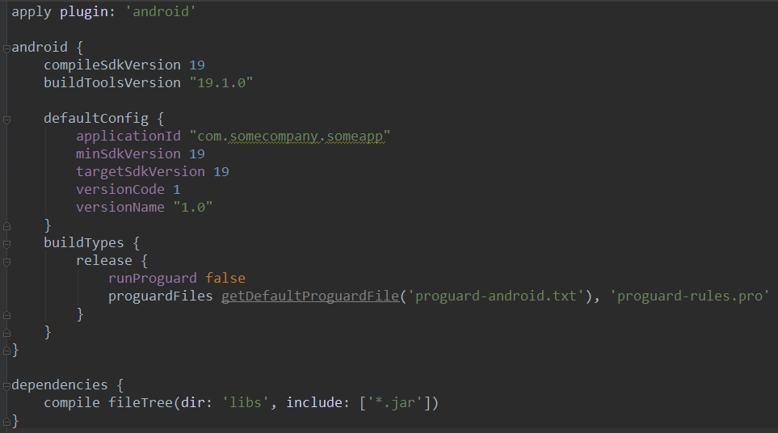

Android Studio 30分钟上手教程
=====================

理由（可略过）
--------------------
Eclipse用的很爽，为什么要学习Android Studio（以下简称AS）？
1. AS基于Intellij Idea，本身就比Eclipse好用（这个需要慢慢体会）
2. Google官方对于AS有很多细腻的细节优化，进一步提升AS的易用性
3. AS自带对于gradle的支持（gradle是什么，以及它的作用，下面会讲到）

准备工作：翻墙
----------------------
AS第一次打开就会下载一大堆东西，这些东西不翻墙基本是无法下载完成的。
- 使用VPN翻墙的人：在打开AS之前先打开VPN。
- 使用GAE翻墙的人：第一次打开AS之后，按`Ctrl`+`Alt`+`S`打开Settings，然后在左边列表中找到HTTP Proxy项，勾选Manual proxy configuration，然后把你的GAE设置进去。  


0~5分钟：AS下载和安装
---------------
从 [这里（需翻墙）](http://tools.android.com/download/studio/canary/latest) 选择自己系统对应的最新的版本，下载并安装（Windows系统**不要安装在系统盘**），然后打开。  


5~10分钟：建立第一个项目
-----------------
点击`Quick Start`中的`New Project`，按照提示一步步走，很简单的，点完finish会进入新的界面，然后就是挡住千万不翻墙的开发者的对话框了：  


如果你已经翻墙的话，几秒至几十秒之后，对话框消失，项目建立完成！  

上图中标记部分简单解释：
1. 标志当前Module，点击它右边的绿色三角就可以运行程序了（AS中的Module相当于Eclipse中的Project）
2. `app`，主Module的目录
3. `libs`，放置本地库文件的地方，和Eclipse中不一样，请注意
4. `src`，工程关键目录，AS的项目结构是基于gradle的，和Eclipse大不相同，一定要注意
5. `app/build.gradle`，主Module的gradle配置文件，程序的所有配置都在这里。build.gradle文件是学习AS最关键的地方，下面详细介绍。

10~30分钟：gradle的极简介绍及build.gradle解析——魔法的核心
----------------
gradle是一个Android Studio默认的项目构建工具。Eclipse是使用的Ant作为构建工具。gradle是时代发展的产物，他和Ant比起来，配置极为简单（其实我没配过Eclipse的Android项目^_^）、功能也更加强大。至于到底多强大，下面我举一个场景，大家感受一下：  
假设你的公司要开发一款App，它面向的主要用户群是学生和白领。老板为了做到市场定位的精准，要求团队把App开发成两个版本：学生版和白领版。这两个版本基本功能一样，只是分别有一个专属模块，这个模块只存在于它所对应的软件版本，而且这两个模块的功能是完全不同的。在开发过程中，软件的基本功能和两个不同版本的专属模块都会随着市场的反馈不断改进和扩展。那么，应该怎样做，才能让团队人员专心于软件的开发，而不是把大量时间和精力都花费在代码的交叉合并上，并且让两个版本的apk都保持足够的纯净（互相不包含对方的代码和图片等）呢？  
对于Ant，这太难了。而对于gradle来说，添加几行代码就能做到。  
gradle的强大不止这点，但本文定位是入门教程，旨在把大家领进门，因此不会讲得太深。接下来，我们对一个新建项目中的app module中的build.gradle文件进行完整的解析。首先请看下图：  

这份文档的内容分为三部分：
1. 第一行：
```groovy
apply plugin: 'android'
```
这一行表示，该项目是一个Android项目
2. 由`android`标签包含着的部分：
```groovy
android {
    compileSdkVersion 19
    buildToolsVersion "19.1.0"

    defaultConfig {
        applicationId "com.somecompany.someapp"
        minSdkVersion 19
        targetSdkVersion 19
        versionCode 1
        versionName "1.0"
    }
    buildTypes {
        release {
            runProguard false
            proguardFiles getDefaultProguardFile('proguard-android.txt'), 'proguard-rules.pro'
        }
    }
}
```
`compileSdkVersion`表示编译时使用的SDK版本；  
`buildToolsVersion`表示使用的buildTools版本；
`applicationId`即App的id，这里简单说一下：从AS 0.6.0开始，AndroidManifest.xml中的packageName的用途被拆分了，今后packageName仅仅用于声明包路径，不再用于App id的定义，App的id由build.gradle中的applicationId单独进行指定。
`minSdkVersion` `targetSdkVersion` `versionCode` `versionName`这四个属性直接覆盖AndroidManifest.xml中的相应属性。换句话说，在gradle中，定义这四个属性的位置从AndroidManifest.xml中提取到了build.gradle中（但实际build出来的AndroidManifest.xml仍然会有这些属性，这里不再详述）。
`buildTypes`中的`release`里面的两行信息，第一行表示正式打包的apk包不使用proguard优化，第二行则是指定了proguard文件的位置（在第一行为false时不生效）
3. 由'dependencies'包含着的部分：
```groovy
dependencies {
    compile fileTree(dir: 'libs', include: ['*.jar'])
}
```
`dependencies`标签内的是项目的所有依赖库。例子中只有一行，这一行表示，在编译时，将libs目录中的所有jar文件作为库文件引入。在实际的项目中，各种本地和在线的库文件与库项目，都会在这里配置。
如果想了解更多关于gradle在Android中的使用，可以看Google官方给出的[指导文档](http://tools.android.com/tech-docs/new-build-system/user-guide)。